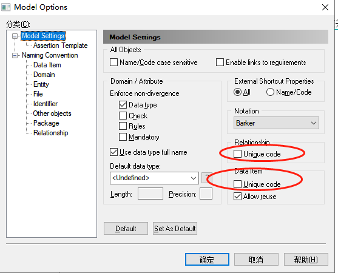
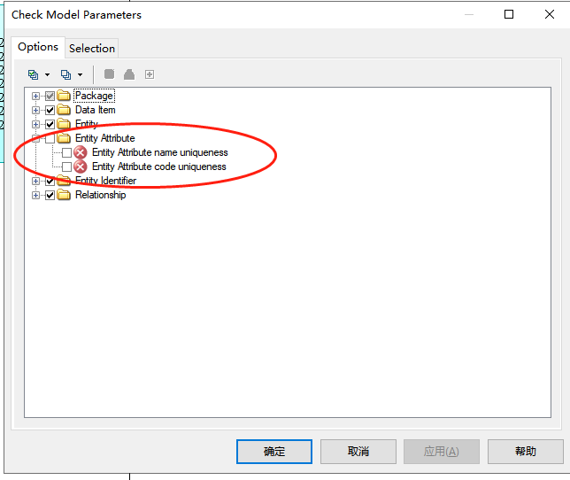

# 零基础项目实训

# powerdesigner 问题：

## 两个表 的属性一致，无法保存。

## cdm和pdm转换时 属性一致的问题。

id 的建议：

品牌表：brand_id, 类目表：category_id。

cdm->pdm->sql

## 异构数据源表结构迁移。

mysql     迁移    oracle

1. mysql 的 表结构导出  sql文件。
2. sql文件 反向生成 pdm.（不同数据库的sql有差异）
3. pdm 转成 cdm。
4. cdm转 pdm
5. pdm 转成sql文件。

框架：datax  。

# 品牌表

图片：图片传到存储上，生成url。存图片的url。   

# 属性

03年上线，只有类目。06年，淘宝引入属性。

不同的类定义不同的属性

## 属性分类

### 关键属性：

确认spu的。手机：品牌，型号。

### 销售属性

确认sku的。手机：颜色，内存。sku。

下单，库存管理。

### 导购属性

手机：新旧程度，报修方式，

### 非关键属性

摄像头，接口类型usb。

用途：搜索，筛选。

为什么这么做，用途，场景？怎么做（技术选型）？原理。

## 属性怎么用

key=value

和类目做关联。（归属于类目）

是否必填。

属性类型：单选，多选，自定义。

### 属性表

### 属性分组表

## 属性库

后台管理系统可维护

# 灵活设计属性高扩展

