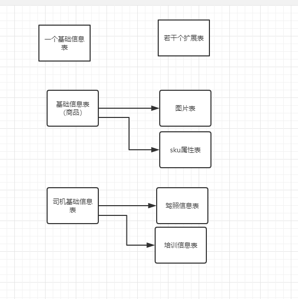

# 零基础项目实训（第21节课）

属性分组  和  类目 强关联。

属性  和  类目  其实 本质是一样的。

# 商品

1张表---->多张表。

如果你觉得，某个功能，以后可以做成独立的服务，那么 将数据提前剥离。

某类数据 特性 很多，可以进行分组的时候，可以独立一张表。

sku：1. 全球统一，2.商家自定义。

1. 商品基础信息表。公共的属性。（商品名称，长，宽，高，包装清单）。

2. 商品详情表。

3. 商品详情图片表。

4. 商品图片。

5. 商品sku信息。

6. 商品sku的属性信息。

   

# 表设计小技巧

名字很重要。goods_base_info,     goods_desc

类：OrderControler, OrderService,  

goods_desc_picture_id     

fdjh 发动机号，   clhp：车辆号牌

# 图片存储

我习惯：图片独立存储，oss（缩略图），云存储。分配一个 图片访问的url。我的数据库中存储  url。

便于管理。不增加存储压力。

url的权限不好控制。

法律风险：还有就是图片的政治敏感，违法校验，交给第三方可以不用自己实现。

数据库里：直接存图片。存储空间占用大。

# 数据表设计思路

1. 属性和类目挂载；
2. 属性和属性分组归类，属性分组和类目挂载。

没有过程的结果是垃圾，没有结果的过程是放屁。