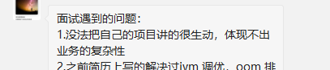

# 零基础项目实训（第25节课）

不懂的 东西 一直拆，拆到懂为止。

# 拼团

业务细节，解决方案细节。

STAR 法则：

S:情景 背景，  T：任务，A：行动，R：结果。

场景：目的：

拉新，提高订单量，提高转化率 6%提升到16%，销量多。

**简历 写 带来的价值。业绩。**

专做拼团：拼多多。 每个团：人数多，

大电商：限时抢购 秒杀。

## 类型：

新人团。判断是否新用户。

普通团：2-10人

超级团：100元，50人 80元，100人 70元，200人 60元。

面试：

整体介绍：star，模块：star

提前想，尽可能多的想。最起码骨架想清楚。

落在纸上（电子版）。能减少思维的负担。

不要想太多。

**先做这个级别的事，再成为这个级别的人。才能挣的多点。**

在公司里，如果考虑的事情和业务相关，上升的可能性就非常大。

冗余。便于查询。

